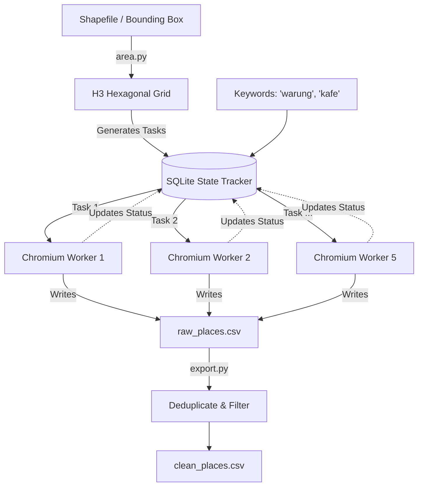

# 🗺️ Gmaps-Extractor

---

## 📂 Folder Structure

```text
gmaps-extractor/
├── src/
│   ├── area.py          # H3
│   ├── browser.py       # Playwright worker pool 
│   ├── export.py        # Deduplication, filtering
│   ├── runner.py        # concurrent scraping
│   ├── schema.py        # data schema of the extracted data
│   ├── scraper.py       # Core HTML extraction logic (ratings, prices, hours)
│   └── state.py         # SQLite Checkpoint tracker
├── data/                # output
├── run_semarang.py      # example run
├── run.sh               # 1-line bash script 
└── README.md
```

---

## 🚀 Installation

Ensure you have [uv](https://docs.astral.sh/uv/) installed. This project relies on `uv` to manage the virtual environment.

1. **Install Python Dependencies:**
   Run this from the project root:
   ```bash
   uv sync
   ```

2. **Install Chromium for Playwright:**
   ```bash
   uv run playwright install chromium
   ```

---

## 🛠️ Usage Guide

### Step 1: Prepare the Search Area (`area.py`)
Before scraping, you must define *where* to search. The `area.py` module takes a geographic boundary and fills it with H3 hexagons. 

**Accepted Inputs:**
- **Shapefiles / GeoJSON**: The most accurate method (e.g., `semarang.shp`).
- **Bounding Box**: A simple `(min_lat, min_lng, max_lat, max_lng)` fallback.

**Arguments:**
- `resolution` (int): Size of the hexagons. `9` is the recommended default (approx 0.1 km² per hex). `8` is larger, `10` is very fine.

```python
from src.area import load_polygon, build_hex_grid, save_area_manifest

poly = load_polygon("data/batas-wilayah-semarang/semarang.shp")
cells = build_hex_grid(poly, resolution=9)
save_area_manifest(cells, resolution=9, path="area_manifest.json")
```

### Step 2: Run the Scraper (`runner.py`)

**Arguments:**
- `area_path` (str): Path to the JSON manifest generated in Step 1.
- `keywords` (list): A list of search queries (e.g., `["warung", "kafe", "rumah sakit"]`).
- `db_path` (str): Path to the SQLite state file (e.g., `state.sqlite`).
- `output_path` (str): Path to the raw CSV dump file.
- `n_workers` (int): How many concurrent browsers to launch.
- `headless` (bool): `True` for invisible background scraping (faster). `False` if you want to watch the browsers.
- `filter_address` (str, optional): A keyword to ensure places belong to the target city (e.g., `"semarang"`).
- `retry_failed` (bool): If `True`, restarting the script will re-attempt any tasks that previously crashed/timed out.

```python
import asyncio
from src.runner import run_scrape

asyncio.run(run_scrape(
    area_path="area_manifest.json",
    keywords=["warung", "kafe"],
    db_path="state.sqlite",
    output_path="raw_places.csv",
    n_workers=5,
    headless=True,
    retry_failed=True
))
```

### Step 3: Export & Clean (`export.py`)

**Features:**
- `deduplicate()`: Groups by `place_id` and keeps the most recent entry.
- `filter_places()`: Removes closed places or places with too few reviews.

```python
from src.export import deduplicate, filter_places

# 1. Remove duplicates
deduplicate("raw_places.csv", "clean_places.csv")

# 2. Filter the clean data (e.g., for ML training sets)
filter_places("clean_places.csv", "training_places.csv", min_reviews=5, exclude_closed=True)
```

---

## Flow & Example

### Flow Diagram



### Example of Input

To start a scrape, you provide a basic Python script (like `run_semarang.py`) with your target criteria:

```python
# 1. Geographic Boundary
poly = load_polygon("data/batas-wilayah-semarang/semarang.shp")

# 2. Search Criteria
keywords = ["warung", "kafe", "kedai", "rumah makan", "angkringan"]

# 3. Execution Settings
n_workers = 5
headless = True
```

### Example of CSV Output

After running the extraction and deduplication, your final output (`places_semarang_clean.csv`) will look like this:

| place_id | name | lat | lng | rating | total_reviews | tags | address | hours | price_level_google | source_cell_id | search_keyword |
|----------|------|-----|-----|--------|---------------|------|---------|-------|--------------------|----------------|----------------|
| 0x2e70... | Warung Bu Joko | -7.0123 | 110.4161 | 4.6 | 187 | Restoran Jawa | Jl. Sultan Agung No.81... | Senin 08.00–21.00... | Rp 1–25.000 | 898d8c... | warung |
| 0x2e70... | Baba Kopitiam | -7.0059 | 110.4167 | 4.5 | 387 | Restoran | Jl. Diponegoro No.45... | Senin 07.00–22.00... | Rp 50–75 rb | 898d8c... | kafe |
| 0x2e70... | Warung Oma | -7.0169 | 110.4185 | 4.7 | 335 | Rumah Makan | Jl. Sultan Agung No.107... | *None* | Rp 25–50 rb | 898d8c... | rumah makan |

*(Note: The actual CSV contains 23 fields including price histograms like `price_rp1_25k_count`, `website`, and `is_price_reviewed`).*

### Executing the Flow

To see this entire flow in action, use the provided bash script to launch the orchestrator over Semarang:

```bash
chmod +x run.sh
./run.sh
```

*(You can safely `Ctrl+C` this script at any time. Running it again will instantly resume exactly where it left off!)*